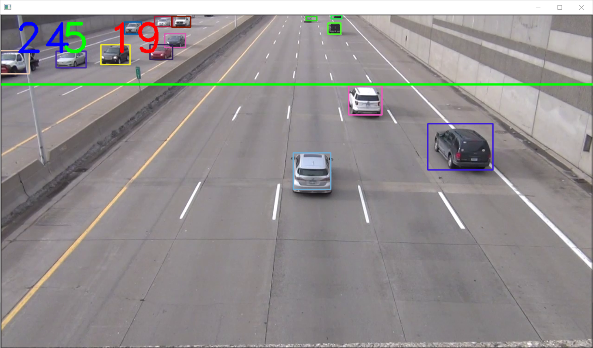

# MultiCarDection

## 随着城市交通量的迅猛增加，车流量统计已成为智能交通系统中一项关键技术和热门研究方向。高效而精确的车流量检测可以交通管理者和决策者，以及驾驶员提供数据支撑，从而为交通调度，降低拥堵情况的发生，提高道路利用率有非常重要的意义。车流量统计主要有以下几种方式:
* 人工统计，需要消耗大量的人力且当工作人员在长时间计数后会因疲惫造成漏检或重复计数，统计结果具有不可验证性。
* 通过安装可接触式或不可接触式的传感器于路面进行车辆计数，可接触式传感器一般铺设于道路下方，当车辆经过时，传感器内部的电压，磁场或压力会发生变换弯成车辆计数。但这类传感器的安装和维护费用很高，现在已不再大量铺设。不可接触式的包括超声，红外，雷达传感器等，这类容易受到恶劣天气的影响使检测精度降低。
* 基于视频的车流量统计，也就是本项目中实现的方法。

# 该项目对输入的视频进行处理，主要包括以下几个步骤：
* 使用yoloV3模型进行目标检测，
* 然后使用SORT算法进行目标追踪，使用卡尔曼滤波器进行目标位置预测，并利用匈牙利算法对比目标的相似度，完成车辆目标追踪，
* 利用虚拟线圈的思想实现车辆目标的计数，完成车流量的统计。项目流程如下图所示：

# 总结
* 目标跟踪方法：使用的是sort算法，其中使用卡尔曼滤波器对目标位置进行估计，利用匈牙利算法进行目标关联
* 车流量计数：使用虚拟线圈算法对车辆进行计数

下面我们将按照流程对该项目进行介绍。
# 检测前一帧图片

# 进行车流量检测之后的

