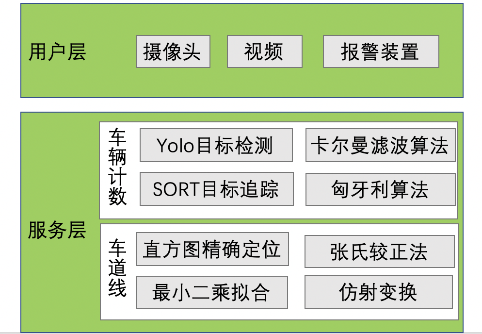
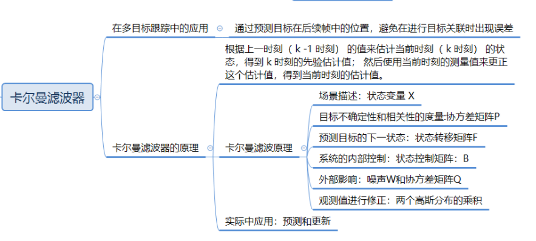
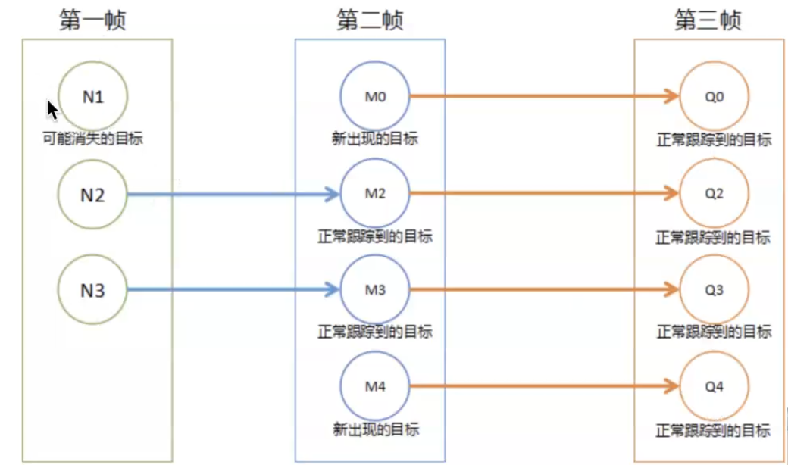

# MultiCarDection

*  随着城市交通量的迅猛增加，车流量统计已成为智能交通系统中一项关键技术和热门研究方向。高效而精确的车流量检测可以交通管理者和决策者，以及驾驶员提供数据支撑，从而为交通调度，降低拥堵情况的发生，提高道路利用率有非常重要的意义。车流量统计主要有以下几种方式:

* 人工统计，需要消耗大量的人力且当工作人员在长时间计数后会因疲惫造成漏检或重复计数，统计结果具有不可验证性。
* 通过安装可接触式或不可接触式的传感器于路面进行车辆计数，可接触式传感器一般铺设于道路下方，当车辆经过时，传感器内部的电压，磁场或压力会发生变换弯成车辆计数。但这类传感器的安装和维护费用很高，现在已不再大量铺设。不可接触式的包括超声，红外，雷达传感器等，这类容易受到恶劣天气的影响使检测精度降低。
* 基于视频的车流量统计，也就是本项目中实现的方法。

# 项目结构

# 该项目对输入的视频进行处理，主要包括以下几个步骤：
* 使用yoloV3模型进行目标检测，
* 然后使用SORT算法进行目标追踪，使用卡尔曼滤波器进行目标位置预测，并利用匈牙利算法对比目标的相似度，完成车辆目标追踪，
* 利用虚拟线圈的思想实现车辆目标的计数，完成车流量的统计。项目流程如下图所示：
# 项目流程

# 1.yoloV3模型进行目标检测

## 1.1 yoloV3的多尺度检测方法
在YOLOv3中采用FPN结构来提高对应多尺度目标检测的精度，当前的feature map利用“未来”层的信息，将低阶特征与高阶特征进行融合，提升检测精度。
## 1.2 yoloV3模型的网络结构
* 以darknet-53为基础，借鉴resnet的思想，在网络中加入了残差模块，利于解决深层次网络的梯度问题
* 整个v3结构里面，没有池化层和全连接层，只有卷积层
* 网络的下采样是通过设置卷积的stride为2来达到的

## 1.3 yoloV3模型先验框设计的方法
* 采用K-means聚类得到先验框的尺寸，为每种尺度设定3种先验框，总共聚类出9种尺寸的先验框。
## 1.4 yoloV3模型为什么适用于多标签的目标分类
* 预测对象类别时不使用softmax，而是使用logistic的输出进行预测
## 1.5 yoloV3模型的输入输出
* 对于416×416×3的输入图像，在每个尺度的特征图的每个网格设置3个先验框，总共有 13×13×3 + 26×26×3 + 52×52×3 = 10647 个预测。每一个预测是一个* * (4+1+80)=85维向量，这个85维向量包含边框坐标（4个数值），边框置信度（1个数值），对象类别的概率（对于COCO数据集，有80种对象）。

# 2.ORT算法进行目标追踪

## 2.1 卡尔曼滤波器

### 1.卡尔曼滤波器中在目标跟踪中的应用
* 卡尔曼滤波器通过预测目标在后续帧中的位置，避免在进行目标关联时出现误差

### 2.卡尔曼滤波器的原理

* 滤波器根据上一时刻（ k -1 时刻） 的值来估计当前时刻（ k 时刻） 的状态，得到 k 时刻的先验估计值； 然后使用当前时刻的测量值来更正这个估计值，得到当前时刻的估计值。
* 目标不确定性和相关性的度量
* 预测目标的下一时刻的状态
* 系统内部的控制和外部的影响
* 利用观测值进行修正
* 实际应用中：预测和更新两个阶段

# 3. 匈牙利算法
* 匈牙利算法（Hungarian Algorithm）与KM算法（Kuhn-Munkres Algorithm）是用来解决多目标跟踪中的数据关联问题，匈牙利算法与KM算法都是为了求解二分图的最大匹配问题。

##  3.1 KM算法
* KM算法解决的是带权二分图的最优匹配问题。

* 匈牙利算法得到的最大匹配并不是唯一的，预设匹配边、或者匹配顺序不同等，都可能会导致有多种最大匹配情况，所以有一种替代KM算法的想法是，我们只需要用匈牙利算法找到所有的最大匹配，比较每个最大匹配的权重，再选出最大权重的最优匹配即可得到更贴近真实情况的匹配结果。但这种方法时间复杂度较高，会随着目标数越来越多，消耗的时间大大增加，实际使用中并不推荐。

# 4. 数据关联

* 在这里我们对检测框和跟踪框进行匹配，整个流程是遍历检测框和跟踪框，并进行匹配，匹配成功的将其保留，未成功的将其删除。

# 5. 虚拟线圈法的车辆统计

* 在上图中，线段AB与线段CD相交，于是我们可以得到两个向量AC，AD，C和D分别在AB的两边，向量AC在向量AB的逆时针方向，AB×AC > 0；向量AD在向量AB的顺时针方向，AB×AD < 0，两叉乘结果异号。
* 这样，方法就出来了：如果线段CD的两个端点C和D，与另一条线段的一个端点（A或B，只能是其中一个）连成的向量，与向量AB做叉乘，若结果异号，表示C和D分别在直线AB的两边，若结果同号，则表示CD两点都在AB的一边，则肯定不相交。
* 叉乘： 二维向量叉乘公式a（x1，y1），b（x2，y2），则a×b=（x1y2-x2y1）
* 所以我们利用叉乘的方法来判断车辆是否经过检测线。

# 总结
* 目标跟踪方法：使用的是sort算法，其中使用卡尔曼滤波器对目标位置进行估计，利用匈牙利算法进行目标关联
* 车流量计数：使用虚拟线圈算法对车辆进行计数

下面我们将按照流程对该项目进行介绍。
# 检测前一帧图片

# 进行车流量检测之后的

